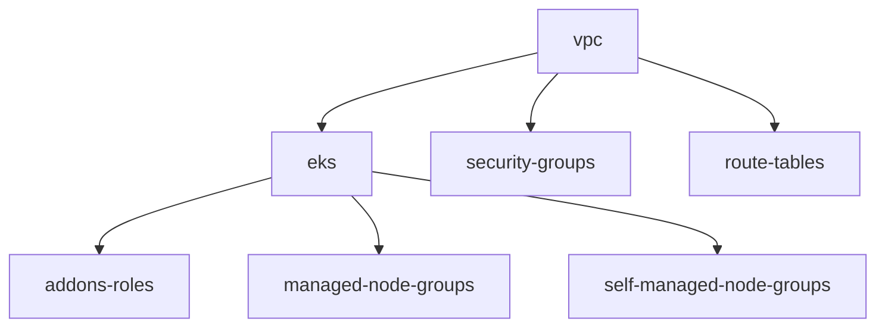

# Amazon Web Services (AWS) Modules

<p align="center">
  
</p>

<p align="center">
  <strong>Production-ready Terraform modules for Amazon Web Services</strong>
</p>

## 🚧 Status: 80% Complete

AWS modules are in active development with core infrastructure components available. Additional modules and features are being added regularly.

## 📦 Available Modules

### Core Infrastructure

#### [`eks`](eks/)
**Amazon Elastic Kubernetes Service cluster with managed and self-managed node groups**
- EKS cluster with configurable node pools
- Managed and self-managed node groups
- IRSA (IAM Roles for Service Accounts) support
- Add-ons management (VPC CNI, EBS CSI, etc.)
- Cluster endpoint configuration
- Security group management

#### [`vpc`](vpc/)
**VPC with public and private subnets for EKS deployment**
- VPC with multiple availability zones
- Public and private subnets
- Internet Gateway and NAT Gateway
- Route tables configuration
- Security groups

#### [`gcp_aws_zone`](gcp_aws_zone/)
**Cross-cloud zone configuration for GCP-AWS integration**
- Cross-cloud connectivity
- Zone mapping configuration
- Network peering setup

## 🚀 Quick Start

### Prerequisites

- [Terraform](https://www.terraform.io/downloads.html) >= 1.0
- [AWS CLI](https://aws.amazon.com/cli/)
- AWS account with appropriate permissions
- S3 bucket for Terraform state

### Basic Usage

```hcl
# Create an EKS cluster
module "eks" {
  source = "git::https://github.com/fast-bi/data-platform-terraform-module.git//aws_cloud/eks"
  
  region         = "us-west-2"
  cluster_name   = "fastbi-cluster"
  cluster_version = "1.28"
  vpc_id         = module.vpc.vpc_id
  subnet_ids     = module.vpc.private_subnet_ids
  
  eks_managed_node_groups = {
    main = {
      min_size     = 1
      max_size     = 10
      desired_size = 3
      instance_types = ["t3.medium"]
    }
  }
}
```

## 🏗️ Architecture Patterns

### Complete AWS Deployment



### Security-First Deployment

```hcl
# Security-hardened EKS cluster
module "eks" {
  source = "git::https://github.com/fast-bi/data-platform-terraform-module.git//aws_cloud/eks"
  
  # Cluster endpoint configuration
  cluster_endpoint_private_access = true
  cluster_endpoint_public_access  = true
  cluster_endpoint_public_access_cidrs = ["10.0.0.0/8"]
  
  # Node group configuration
  eks_managed_node_groups = {
    main = {
      min_size     = 3
      max_size     = 10
      desired_size = 5
      instance_types = ["t3.medium"]
      
      labels = {
        Environment = "production"
        Team        = "data-platform"
      }
    }
  }
}
```

## 🔧 Configuration Examples

### Multi-Environment Setup

```hcl
# Development environment
locals {
  environment = "dev"
  cluster_name = "fastbi-dev-cluster"
}

inputs = {
  eks_managed_node_groups = {
    main = {
      min_size     = 1
      max_size     = 3
      desired_size = 2
      instance_types = ["t3.small"]
    }
  }
}
```

### Production Environment

```hcl
# Production environment
inputs = {
  eks_managed_node_groups = {
    main = {
      min_size     = 3
      max_size     = 20
      desired_size = 5
      instance_types = ["t3.medium", "t3.large"]
    }
    
    spot = {
      min_size     = 0
      max_size     = 10
      desired_size = 3
      instance_types = ["t3.medium", "t3.large"]
      
      taints = [
        {
          key    = "spot"
          value  = "true"
          effect = "NO_SCHEDULE"
        }
      ]
    }
  }
}
```

## 🛡️ Security Best Practices

### Network Security
- Use private subnets for worker nodes
- Implement proper security groups
- Enable VPC Flow Logs for monitoring
- Use NAT Gateway for outbound internet access

### Identity and Access Management
- Use IRSA (IAM Roles for Service Accounts) for pod-to-AWS authentication
- Implement least privilege access
- Enable audit logging
- Use AWS IAM roles instead of access keys

### Data Protection
- Enable encryption at rest and in transit
- Use AWS KMS for key management
- Implement backup and disaster recovery
- Regular security scanning

## 📊 Monitoring and Observability

### Enable Monitoring

```hcl
# In your EKS configuration
inputs = {
  # Enable add-ons for monitoring
  vpc_cni_version = "v1.14.1-eksbuild.1"
  ebs_csi_version = "v1.24.1-eksbuild.1"
  coredns_version = "v1.10.1-eksbuild.1"
}
```

### Set Up Alerts

1. **Cluster Health**: Monitor cluster and node health
2. **Resource Usage**: Track CPU, memory, and storage usage
3. **Security Events**: Monitor for security-related events
4. **Cost Optimization**: Track resource costs and usage

## 🔄 Maintenance and Updates

### Regular Maintenance

1. **Update Kubernetes versions** regularly
2. **Rotate IAM roles and policies** periodically
3. **Review and update security groups**
4. **Monitor and optimize costs**

### Backup Strategy

1. **Terraform state**: Store in versioned, encrypted S3 buckets
2. **Cluster backups**: Enable automated backups
3. **Configuration**: Version control all configurations
4. **Documentation**: Keep deployment documentation updated

## 🆘 Troubleshooting

### Common Issues

1. **Permission Errors**
   - Verify IAM roles and policies
   - Check service account configurations
   - Ensure proper authentication

2. **Network Issues**
   - Verify VPC and subnet configurations
   - Check security groups
   - Validate route tables

3. **Resource Limits**
   - Check AWS service limits
   - Verify resource availability in regions
   - Monitor resource usage

### Getting Help

- Check module-specific documentation
- Review Terraform and Terragrunt logs
- Consult [AWS documentation](https://docs.aws.amazon.com/)
- Join the Fast.BI community for support

## 📋 Roadmap

### Planned Modules (Coming Soon)

- **RDS** - Relational Database Service
- **S3** - Simple Storage Service
- **Route53** - DNS management
- **CloudFront** - Content Delivery Network
- **ElastiCache** - In-memory caching
- **Secrets Manager** - Secrets management
- **KMS** - Key Management Service
- **CloudWatch** - Monitoring and logging

### Upcoming Features

- **Multi-AZ support** for high availability
- **Spot instance integration** for cost optimization
- **Auto Scaling Groups** for dynamic scaling
- **Load Balancer** integration
- **Cross-cloud connectivity** modules

## 📚 Additional Resources

- [AWS Best Practices](https://aws.amazon.com/architecture/well-architected/)
- [EKS Security Best Practices](https://aws.github.io/aws-eks-best-practices/)
- [Terraform AWS Provider](https://registry.terraform.io/providers/hashicorp/aws/latest/docs)
- [Fast.BI Documentation](https://wiki.fast.bi)

## 📄 License

This module is licensed under the [MIT License](../LICENSE).

---

<p align="center">
  <strong>Ready to deploy on Amazon Web Services?</strong><br>
  <a href="https://fast.bi">Get Started with Fast.BI</a> • 
  <a href="https://wiki.fast.bi">Documentation</a> • 
  <a href="https://github.com/fast-bi/data-platform-terraform-module/issues">Report Issues</a>
</p>
