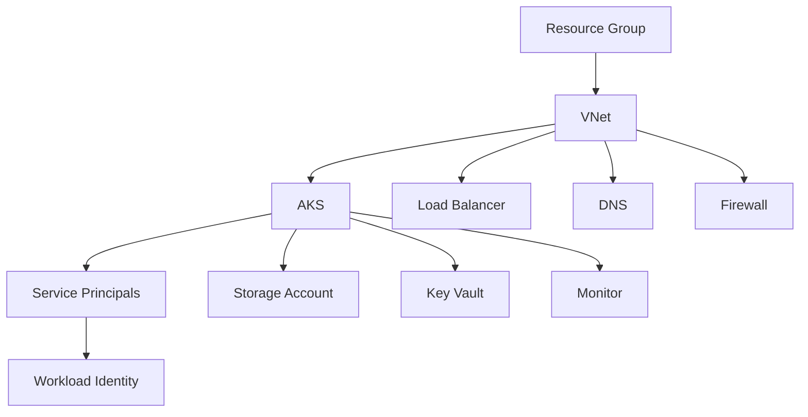

# Microsoft Azure Modules

<p align="center">
  
</p>

<p align="center">
  <strong>Production-ready Terraform modules for Microsoft Azure</strong>
</p>

## 📅 Status: Coming Q4 2025

Azure modules are planned for Q4 2025. We're currently in the planning and design phase, gathering requirements and designing the module architecture.

## 🎯 Planned Modules

### Core Infrastructure

#### **AKS** - Azure Kubernetes Service
- AKS cluster with configurable node pools
- Managed identity integration
- Azure CNI networking
- Private cluster options
- Security hardening and compliance

#### **VNet** - Virtual Network
- Virtual Network with subnets
- Network Security Groups
- Azure Firewall integration
- VPN Gateway support
- ExpressRoute connectivity

#### **Resource Groups** - Resource Group Management
- Resource group creation and management
- Tagging and organization
- Access control and permissions
- Lifecycle management

### Storage & Data

#### **Storage Accounts** - Azure Storage
- Blob storage configuration
- File share setup
- Data Lake Gen2 integration
- Backup and disaster recovery
- Security and encryption

#### **Key Vault** - Secrets Management
- Key Vault creation and configuration
- Secret and key management
- Access policies and RBAC
- Certificate management
- Integration with AKS

### Identity & Access

#### **Service Principals** - Identity Management
- Service principal creation
- Role assignments
- Managed identity integration
- AKS workload identity
- Cross-tenant authentication

#### **RBAC** - Role-Based Access Control
- Custom role definitions
- Role assignments
- Conditional access policies
- Privileged Identity Management
- Audit and compliance

### Networking & Security

#### **Load Balancer** - Load Balancing
- Application Gateway
- Standard Load Balancer
- Traffic Manager
- Front Door integration
- SSL termination

#### **DNS** - DNS Management
- Azure DNS zones
- Record management
- Private DNS zones
- Custom domain integration
- Health checks

### Monitoring & Operations

#### **Monitor** - Azure Monitor
- Log Analytics workspace
- Application Insights
- Alerts and notifications
- Dashboards and workbooks
- Cost management

#### **Backup** - Backup Services
- Azure Backup
- Site Recovery
- Point-in-time recovery
- Cross-region backup
- Compliance reporting

## 🏗️ Planned Architecture

### Complete Azure Deployment



### Security-First Design

```hcl
# Planned security-hardened AKS cluster
module "aks" {
  source = "git::https://github.com/fast-bi/data-platform-terraform-module.git//azure_cloud/aks"
  
  # Network security
  private_cluster_enabled = true
  network_plugin = "azure"
  
  # Identity and access
  workload_identity_enabled = true
  managed_identity_enabled = true
  
  # Security features
  enable_pod_security_policy = true
  enable_network_policy = true
  
  # Monitoring
  monitoring_enabled = true
  log_analytics_workspace_id = module.monitor.workspace_id
}
```

## 🚀 Getting Ready for Azure

### Prerequisites (When Available)

- [Terraform](https://www.terraform.io/downloads.html) >= 1.0
- [Azure CLI](https://docs.microsoft.com/en-us/cli/azure/install-azure-cli)
- Azure subscription with appropriate permissions
- Storage account for Terraform state

### Planned Quick Start

```hcl
# Planned basic AKS deployment
module "aks" {
  source = "git::https://github.com/fast-bi/data-platform-terraform-module.git//azure_cloud/aks"
  
  resource_group_name = "fastbi-rg"
  location           = "East US"
  cluster_name       = "fastbi-cluster"
  node_count         = 3
  vm_size           = "Standard_D2s_v3"
}
```

## 🛡️ Security Considerations

### Planned Security Features

- **Private Clusters**: Secure cluster endpoints
- **Managed Identity**: No secrets in code
- **RBAC**: Fine-grained access control
- **Network Policies**: Pod-to-pod communication control
- **Encryption**: At rest and in transit
- **Compliance**: SOC 2, ISO 27001, HIPAA

### Identity and Access Management

- **Azure AD Integration**: Enterprise identity
- **Workload Identity**: Pod-to-Azure authentication
- **Service Principals**: Application authentication
- **Conditional Access**: Risk-based policies
- **Privileged Access**: Just-in-time access

## 📊 Monitoring and Observability

### Planned Monitoring Features

- **Azure Monitor**: Comprehensive monitoring
- **Application Insights**: Application performance
- **Log Analytics**: Centralized logging
- **Alerts**: Proactive notifications
- **Dashboards**: Visual monitoring
- **Cost Management**: Resource optimization

## 🔄 Development Timeline

### Q3 2025 - Planning & Design
- [ ] Requirements gathering
- [ ] Architecture design
- [ ] Security review
- [ ] Performance testing

### Q4 2025 - Development & Testing
- [ ] Core modules development
- [ ] Security modules
- [ ] Networking modules
- [ ] Testing and validation

### Q1 2026 - Release & Documentation
- [ ] Documentation completion
- [ ] Example deployments
- [ ] Community feedback
- [ ] Production readiness

## 🤝 Contributing

We welcome contributions to the Azure modules development:

1. **Requirements**: Share your Azure infrastructure needs
2. **Design**: Help design module interfaces
3. **Testing**: Participate in beta testing
4. **Documentation**: Help create comprehensive docs

### How to Get Involved

- **GitHub Issues**: Share requirements and feedback
- **Discussions**: Join design discussions
- **Beta Testing**: Sign up for early access
- **Documentation**: Help improve docs

## 📚 Resources

### Azure Documentation
- [Azure Kubernetes Service](https://docs.microsoft.com/en-us/azure/aks/)
- [Azure Virtual Network](https://docs.microsoft.com/en-us/azure/virtual-network/)
- [Azure Key Vault](https://docs.microsoft.com/en-us/azure/key-vault/)
- [Azure Monitor](https://docs.microsoft.com/en-us/azure/azure-monitor/)

### Terraform Azure Provider
- [Terraform Azure Provider](https://registry.terraform.io/providers/hashicorp/azurerm/latest/docs)
- [Azure Provider Examples](https://github.com/hashicorp/terraform-provider-azurerm/tree/main/examples)

### Fast.BI Resources
- [Fast.BI Documentation](https://wiki.fast.bi)
- [Fast.BI Community](https://fast.bi/community)
- [GitHub Discussions](https://github.com/fast-bi/data-platform-terraform-module/discussions)

## 📄 License

This module is licensed under the [MIT License](../LICENSE).

---

<p align="center">
  <strong>Interested in Azure support?</strong><br>
  <a href="https://github.com/fast-bi/data-platform-terraform-module/discussions">Join the Discussion</a> • 
  <a href="https://fast.bi">Get Started with Fast.BI</a> • 
  <a href="https://wiki.fast.bi">Documentation</a>
</p>
