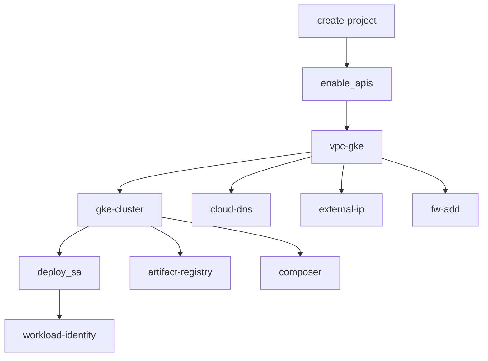
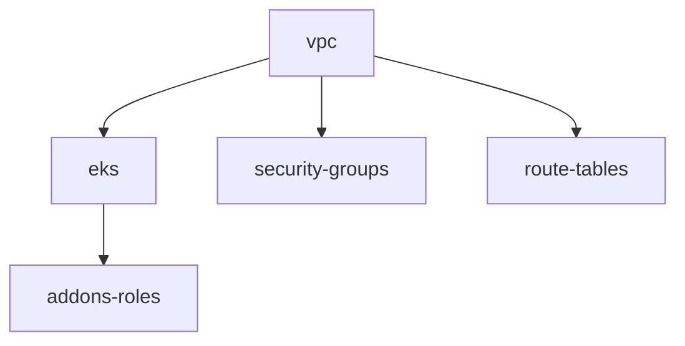

# Fast.BI Terraform Modules - Module Reference

This document provides detailed information about each module in the Fast.BI Terraform modules repository.

## 📚 Table of Contents

- [Google Cloud Platform Modules](#google-cloud-platform-modules)
- [Amazon Web Services Modules](#amazon-web-services-modules)
- [Module Dependencies](#module-dependencies)
- [Common Patterns](#common-patterns)

## Google Cloud Platform Modules

### Core Infrastructure

#### `google_cloud/gke-cluster`

Creates a Google Kubernetes Engine cluster with secondary subnets for pods and services.

**Key Features:**
- GKE cluster with configurable node pools
- Secondary IP ranges for pods and services
- Workload Identity support
- Private cluster options
- Security hardening (secrets encryption, RBAC)

**Inputs:**
- `project` (string, required): GCP project ID
- `location` (string, required): Cluster location (region or zone)
- `name` (string, required): Cluster name
- `network` (string, required): VPC network reference
- `subnetwork` (string, required): Subnet reference
- `min_node_count` (string, required): Minimum node count
- `max_node_count` (string, required): Maximum node count
- `cluster_secondary_range_name` (string, required): Pod IP range name
- `service_secondary_range_name` (string, required): Service IP range name

**Outputs:**
- `cluster_id`: GKE cluster ID
- `cluster_endpoint`: Cluster API endpoint
- `cluster_ca_certificate`: Cluster CA certificate
- `cluster_name`: Cluster name

**Example:**
```hcl
module "gke_cluster" {
  source = "git::https://github.com/fast-bi/terraform-modules.git//google_cloud/gke-cluster"
  
  project     = "my-project"
  location    = "us-central1"
  name        = "fastbi-cluster"
  network     = "projects/my-project/global/networks/fastbi-vpc"
  subnetwork  = "projects/my-project/regions/us-central1/subnetworks/fastbi-subnet"
  
  min_node_count = "3"
  max_node_count = "10"
  
  cluster_secondary_range_name = "pods"
  service_secondary_range_name = "services"
}
```

#### `google_cloud/vpc-gke`

Creates a VPC with secondary subnets for GKE pod and service networks.

**Key Features:**
- VPC with custom subnets
- Secondary IP ranges for GKE
- Cloud NAT for outbound internet access
- Firewall rules for private access
- VPC router configuration

**Inputs:**
- `project` (string, required): GCP project ID
- `region` (string, required): GCP region
- `name` (string, required): VPC name

**Outputs:**
- `network`: VPC network reference
- `subnet`: Subnet reference
- `pods_range_name`: Pod IP range name
- `services_range_name`: Service IP range name

#### `google_cloud/shared-vpc`

Creates a shared VPC for multi-project architectures.

**Key Features:**
- Shared VPC host project
- Service project attachment
- Subnet IAM bindings
- Private Service Access configuration
- Cloud NAT support

**Inputs:**
- `project` (string, required): Host project ID
- `region` (string, required): GCP region
- `vpc_name` (string, required): VPC name
- `shared_vpc_service_projects` (list): Service projects to attach

### Security & Access

#### `google_cloud/deploy_sa`

Creates service accounts with IAM roles and workload identity mappings.

**Key Features:**
- Multiple service account creation
- IAM role assignment
- Workload Identity mapping
- Key generation (optional)
- Graceful handling of existing resources

**Inputs:**
- `project` (string, required): GCP project ID
- `sa_names` (list): Service account names
- `project_roles` (list): IAM roles to assign
- `generate_keys_for_sa` (bool): Generate service account keys
- `wid_mapping_to_sa` (list): Workload Identity mappings

**Outputs:**
- `sa_email`: First service account email
- `all_sa_emails`: Map of all service account emails
- `service_accounts`: Map of created service accounts

#### `google_cloud/iam-add`

Manages IAM roles and policies.

**Key Features:**
- Project-level IAM bindings
- Organization-level IAM bindings
- Custom role creation
- Conditional IAM policies

#### `google_cloud/iap-brand`

Configures Identity-Aware Proxy brand.

**Key Features:**
- IAP brand creation
- OAuth consent screen configuration
- Support URL configuration

#### `google_cloud/bastion_host`

Creates a secure bastion host for private cluster access.

**Key Features:**
- Compute Engine instance
- IAP tunnel configuration
- Startup script for access setup
- Firewall rules for SSH access

### Networking & DNS

#### `google_cloud/cloud-dns`

Manages Cloud DNS zones.

**Key Features:**
- DNS zone creation
- Zone configuration
- DNSSEC support

#### `google_cloud/cloud-dns-recordset`

Manages DNS records.

**Key Features:**
- A, AAAA, CNAME, MX records
- TXT records for verification
- PTR records for reverse DNS

#### `google_cloud/external-ip`

Allocates external IP addresses.

**Key Features:**
- Static IP allocation
- Regional and global IPs
- IP reservation

#### `google_cloud/fw-add`

Manages firewall rules.

**Key Features:**
- Ingress and egress rules
- Source and target tags
- Port and protocol configuration

### Development & Operations

#### `google_cloud/artifact-registry`

Creates container registries.

**Key Features:**
- Docker repository creation
- IAM permissions
- Cleanup policies

#### `google_cloud/composer`

Creates managed Apache Airflow environments.

**Key Features:**
- Composer environment creation
- Airflow configuration
- Environment variables
- PyPI package installation

#### `google_cloud/workspace_user`

Manages Google Workspace users.

**Key Features:**
- User creation and management
- Group membership
- License assignment

#### `google_cloud/kubeconfig`

Generates Kubernetes configuration.

**Key Features:**
- Kubeconfig generation
- Cluster access configuration
- Context management

### Project Management

#### `google_cloud/create-project`

Creates and configures GCP projects.

**Key Features:**
- Project creation
- Billing account association
- Organization/folder assignment
- Project labels

#### `google_cloud/create-ou-folder`

Creates organization units and folders.

**Key Features:**
- Folder hierarchy creation
- Organization unit management
- IAM inheritance

#### `google_cloud/enable_apis`

Enables Google Cloud APIs.

**Key Features:**
- API enablement
- Service account creation
- API quotas management

## Amazon Web Services Modules

### Core Infrastructure

#### `aws_cloud/eks`

Creates Amazon Elastic Kubernetes Service cluster.

**Key Features:**
- EKS cluster with managed and self-managed node groups
- IRSA (IAM Roles for Service Accounts) support
- Add-ons management (VPC CNI, EBS CSI, etc.)
- Cluster endpoint configuration
- Security group management

**Inputs:**
- `region` (string, required): AWS region
- `cluster_name` (string, required): EKS cluster name
- `cluster_version` (string, required): Kubernetes version
- `vpc_id` (string, required): VPC ID
- `subnet_ids` (list, required): Subnet IDs
- `eks_managed_node_groups` (map): Managed node group configuration
- `self_managed_node_groups` (map): Self-managed node group configuration

**Outputs:**
- `cluster_id`: EKS cluster ID
- `cluster_arn`: EKS cluster ARN
- `cluster_endpoint`: Cluster API endpoint
- `cluster_certificate_authority_data`: Cluster CA certificate

#### `aws_cloud/vpc`

Creates VPC with public and private subnets.

**Key Features:**
- VPC with multiple availability zones
- Public and private subnets
- Internet Gateway and NAT Gateway
- Route tables configuration
- Security groups

**Inputs:**
- `region` (string, required): AWS region
- `name` (string, required): VPC name
- `cidr_block` (string): VPC CIDR block
- `availability_zones` (list): Availability zones

**Outputs:**
- `vpc_id`: VPC ID
- `public_subnet_ids`: Public subnet IDs
- `private_subnet_ids`: Private subnet IDs
- `internet_gateway_id`: Internet Gateway ID

#### `aws_cloud/gcp_aws_zone`

Configures cross-cloud zone for GCP-AWS integration.

**Key Features:**
- Cross-cloud connectivity
- Zone mapping configuration
- Network peering setup

## Module Dependencies

### GCP Module Dependencies



### AWS Module Dependencies



## Common Patterns

### Multi-Environment Setup

```hcl
# environments/dev/terragrunt.hcl
locals {
  environment = "dev"
  project_id  = "fastbi-dev-${random_id.suffix.hex}"
}

inputs = {
  min_node_count = 1
  max_node_count = 3
  machine_type   = "e2-small"
}
```

### Cross-Cloud Configuration

```hcl
# gcp/terragrunt.hcl
inputs = {
  project = "fastbi-gcp"
  region  = "us-central1"
}

# aws/terragrunt.hcl
inputs = {
  region = "us-west-2"
}

# cross-cloud/terragrunt.hcl
inputs = {
  gcp_project = dependency.gcp.outputs.project_id
  aws_region  = dependency.aws.outputs.region
}
```

### Security Hardening

```hcl
# Security-focused configuration
inputs = {
  # Network security
  enable_private_nodes = true
  disable_public_endpoint = true
  
  # Identity security
  enable_workload_identity = true
  enable_secrets_database_encryption = true
  
  # Access control
  master_authorized_networks_config = [{
    cidr_blocks = [{
      cidr_block   = "10.0.0.0/8"
      display_name = "corporate_network"
    }]
  }]
}
```

### Cost Optimization

```hcl
# Cost-optimized configuration
inputs = {
  # Use preemptible instances
  preemptible = true
  
  # Smaller node pools
  min_node_count = 1
  max_node_count = 5
  
  # Efficient machine types
  machine_type = "e2-standard-2"
  
  # Auto-scaling
  enable_vertical_pod_autoscaling = true
}
```

## Best Practices

### 1. Use Terragrunt for DRY Configuration

```hcl
# terragrunt.hcl
remote_state {
  backend = "gcs"
  config = {
    bucket = "fastbi-terraform-state"
    prefix = "${path_relative_to_include()}"
  }
}

generate "provider" {
  path      = "provider.tf"
  if_exists = "overwrite_terragrunt"
  contents  = <<EOF
provider "google" {
  project = "fastbi-production"
  region  = "us-central1"
}
EOF
}
```

### 2. Implement Proper State Management

```hcl
# Use remote state backends
remote_state {
  backend = "gcs"  # or "s3" for AWS
  config = {
    bucket = "your-terraform-state-bucket"
    prefix = "${path_relative_to_include()}"
  }
}
```

### 3. Use Dependencies for Proper Ordering

```hcl
dependencies {
  paths = ["../vpc", "../service-accounts"]
}

inputs = {
  network    = dependency.vpc.outputs.network
  subnet     = dependency.vpc.outputs.subnet
  sa_email   = dependency.service_accounts.outputs.sa_email
}
```

### 4. Implement Security Best Practices

- Use private clusters when possible
- Enable Workload Identity (GCP) or IRSA (AWS)
- Implement least privilege access
- Enable audit logging
- Use customer-managed encryption keys

### 5. Monitor and Alert

```hcl
# Enable monitoring
inputs = {
  logging_service    = "logging.googleapis.com/kubernetes"
  monitoring_service = "monitoring.googleapis.com/kubernetes"
  
  # Set up alerts
  enable_vertical_pod_autoscaling = true
}
```

## Troubleshooting

### Common Issues

1. **Permission Errors**
   - Verify IAM roles and permissions
   - Check service account configurations
   - Ensure proper authentication

2. **Network Issues**
   - Verify VPC and subnet configurations
   - Check firewall rules
   - Validate DNS settings

3. **Resource Limits**
   - Check cloud provider quotas
   - Verify resource availability in regions
   - Monitor resource usage

### Getting Help

- Check module-specific documentation
- Review Terraform and Terragrunt logs
- Consult cloud provider documentation
- Join the Fast.BI community for support

For more information, visit the [Fast.BI Documentation](https://wiki.fast.bi).
