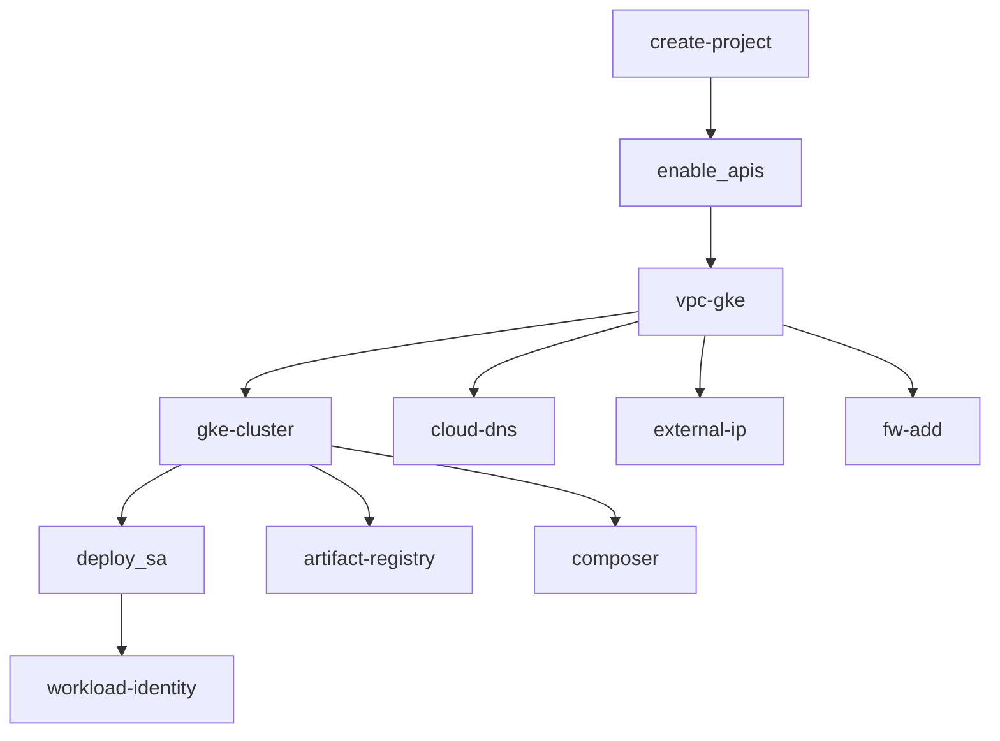

# Google Cloud Platform (GCP) Modules

<p align="center">
  
</p>

<p align="center">
  <strong>Production-ready Terraform modules for Google Cloud Platform</strong>
</p>

## ✅ Status: 100% Complete

All GCP modules are production-ready and fully tested. These modules provide comprehensive infrastructure automation for deploying Fast.BI on Google Cloud Platform.

## 📦 Available Modules

### Core Infrastructure

#### [`gke-cluster`](gke-cluster/)
**Google Kubernetes Engine cluster with secondary subnets for pods and services**
- GKE cluster with configurable node pools
- Secondary IP ranges for pods and services
- Workload Identity support
- Private cluster options
- Security hardening (secrets encryption, RBAC)

#### [`vpc-gke`](vpc-gke/)
**VPC with secondary subnets for GKE pod and service networks**
- VPC with custom subnets
- Secondary IP ranges for GKE
- Cloud NAT for outbound internet access
- Firewall rules for private access
- VPC router configuration

#### [`shared-vpc`](shared-vpc/)
**Shared VPC for multi-project architectures**
- Shared VPC host project
- Service project attachment
- Subnet IAM bindings
- Private Service Access configuration
- Cloud NAT support

#### [`vpc-gke-shared`](vpc-gke-shared/)
**VPC configuration for shared GKE clusters**
- Shared VPC integration
- GKE-specific networking
- Cross-project resource sharing

### Security & Access

#### [`deploy_sa`](deploy_sa/)
**Service account creation with IAM roles and workload identity**
- Multiple service account creation
- IAM role assignment
- Workload Identity mapping
- Key generation (optional)
- Graceful handling of existing resources

#### [`iam-add`](iam-add/)
**IAM role and policy management**
- Project-level IAM bindings
- Organization-level IAM bindings
- Custom role creation
- Conditional IAM policies

#### [`iap-brand`](iap-brand/)
**Identity-Aware Proxy brand configuration**
- IAP brand creation
- OAuth consent screen configuration
- Support URL configuration

#### [`bastion_host`](bastion_host/)
**Secure bastion host for private cluster access**
- Compute Engine instance
- IAP tunnel configuration
- Startup script for access setup
- Firewall rules for SSH access

### Networking & DNS

#### [`cloud-dns`](cloud-dns/)
**Cloud DNS zone management**
- DNS zone creation
- Zone configuration
- DNSSEC support

#### [`cloud-dns-recordset`](cloud-dns-recordset/)
**DNS record management**
- A, AAAA, CNAME, MX records
- TXT records for verification
- PTR records for reverse DNS

#### [`external-ip`](external-ip/)
**External IP address allocation**
- Static IP allocation
- Regional and global IPs
- IP reservation

#### [`fw-add`](fw-add/)
**Firewall rule management**
- Ingress and egress rules
- Source and target tags
- Port and protocol configuration

### Development & Operations

#### [`artifact-registry`](artifact-registry/)
**Container registry for Docker images**
- Docker repository creation
- IAM permissions
- Cleanup policies

#### [`composer`](composer/)
**Managed Apache Airflow environment**
- Composer environment creation
- Airflow configuration
- Environment variables
- PyPI package installation

#### [`workspace_user`](workspace_user/)
**Google Workspace user management**
- User creation and management
- Group membership
- License assignment

#### [`kubeconfig`](kubeconfig/)
**Kubernetes configuration generation**
- Kubeconfig generation
- Cluster access configuration
- Context management

### Project Management

#### [`create-project`](create-project/)
**GCP project creation and configuration**
- Project creation
- Billing account association
- Organization/folder assignment
- Project labels

#### [`create-ou-folder`](create-ou-folder/)
**Organization unit and folder structure**
- Folder hierarchy creation
- Organization unit management
- IAM inheritance

#### [`enable_apis`](enable_apis/)
**Google Cloud API enablement**
- API enablement
- Service account creation
- API quotas management

## 🚀 Quick Start

### Prerequisites

- [Terraform](https://www.terraform.io/downloads.html) >= 1.0
- [Google Cloud SDK](https://cloud.google.com/sdk/docs/install)
- GCP project with billing enabled
- Appropriate IAM permissions

### Basic Usage

```hcl
# Create a GKE cluster
module "gke_cluster" {
  source = "git::https://github.com/fast-bi/data-platform-terraform-module.git//google_cloud/gke-cluster"
  
  project     = "my-project"
  location    = "us-central1"
  region      = "us-central1"
  name        = "fastbi-cluster"
  network     = "projects/my-project/global/networks/fastbi-vpc"
  subnetwork  = "projects/my-project/regions/us-central1/subnetworks/fastbi-subnet"
  
  min_node_count = "3"
  max_node_count = "10"
  
  cluster_secondary_range_name = "pods"
  service_secondary_range_name = "services"
}
```

## 🏗️ Architecture Patterns

### Complete GCP Deployment



### Security-First Deployment

```hcl
# Security-hardened GKE cluster
module "gke_cluster" {
  source = "git::https://github.com/fast-bi/data-platform-terraform-module.git//google_cloud/gke-cluster"
  
  # Network security
  enable_private_nodes = true
  disable_public_endpoint = true
  master_ipv4_cidr_block = "172.16.0.0/28"
  
  # Access control
  master_authorized_networks_config = [{
    cidr_blocks = [{
      cidr_block   = "10.0.0.0/8"
      display_name = "corporate_network"
    }]
  }]
  
  # Encryption
  enable_secrets_database_encryption = true
  enable_workload_identity = true
  
  # Monitoring
  logging_service    = "logging.googleapis.com/kubernetes"
  monitoring_service = "monitoring.googleapis.com/kubernetes"
}
```

## 🔧 Configuration Examples

### Multi-Environment Setup

```hcl
# Development environment
locals {
  environment = "dev"
  project_id  = "fastbi-dev-${random_id.suffix.hex}"
}

inputs = {
  min_node_count = 1
  max_node_count = 3
  machine_type   = "e2-small"
  preemptible    = true
}
```

### Production Environment

```hcl
# Production environment
inputs = {
  min_node_count = 3
  max_node_count = 20
  machine_type   = "e2-standard-4"
  preemptible    = false
  
  # High availability
  node_locations = ["us-central1-a", "us-central1-b", "us-central1-c"]
  
  # Security
  enable_private_nodes = true
  enable_workload_identity = true
}
```

## 🛡️ Security Best Practices

### Network Security
- Use private clusters when possible
- Implement proper firewall rules
- Enable VPC Flow Logs for monitoring
- Use Cloud NAT for outbound internet access

### Identity and Access Management
- Create dedicated service accounts for each component
- Use Workload Identity for pod-to-GCP authentication
- Implement least privilege access
- Enable audit logging

### Data Protection
- Enable encryption at rest and in transit
- Use customer-managed encryption keys
- Implement backup and disaster recovery
- Regular security scanning

## 📊 Monitoring and Observability

### Enable Monitoring

```hcl
# In your GKE configuration
inputs = {
  logging_service    = "logging.googleapis.com/kubernetes"
  monitoring_service = "monitoring.googleapis.com/kubernetes"
  
  # Enable monitoring addons
  enable_vertical_pod_autoscaling = true
}
```

### Set Up Alerts

1. **Cluster Health**: Monitor cluster and node health
2. **Resource Usage**: Track CPU, memory, and storage usage
3. **Security Events**: Monitor for security-related events
4. **Cost Optimization**: Track resource costs and usage

## 🔄 Maintenance and Updates

### Regular Maintenance

1. **Update Kubernetes versions** regularly
2. **Rotate service account keys** periodically
3. **Review and update IAM permissions**
4. **Monitor and optimize costs**

### Backup Strategy

1. **Terraform state**: Store in versioned, encrypted backends
2. **Cluster backups**: Enable automated backups
3. **Configuration**: Version control all configurations
4. **Documentation**: Keep deployment documentation updated

## 🆘 Troubleshooting

### Common Issues

1. **Permission Errors**
   - Verify IAM roles and permissions
   - Check service account configurations
   - Ensure proper authentication

2. **Network Issues**
   - Verify VPC and subnet configurations
   - Check firewall rules
   - Validate DNS settings

3. **Resource Limits**
   - Check GCP quotas
   - Verify resource availability in regions
   - Monitor resource usage

### Getting Help

- Check module-specific documentation
- Review Terraform and Terragrunt logs
- Consult [Google Cloud documentation](https://cloud.google.com/docs)
- Join the Fast.BI community for support

## 📚 Additional Resources

- [Google Cloud Best Practices](https://cloud.google.com/docs/enterprise/best-practices-for-enterprise-organizations)
- [GKE Security Best Practices](https://cloud.google.com/kubernetes-engine/docs/how-to/hardening-your-cluster)
- [Terraform Google Provider](https://registry.terraform.io/providers/hashicorp/google/latest/docs)
- [Fast.BI Documentation](https://wiki.fast.bi)

## 📄 License

This module is licensed under the [MIT License](../LICENSE).

---

<p align="center">
  <strong>Ready to deploy on Google Cloud Platform?</strong><br>
  <a href="https://fast.bi">Get Started with Fast.BI</a> • 
  <a href="https://wiki.fast.bi">Documentation</a> • 
  <a href="https://github.com/fast-bi/data-platform-terraform-module/issues">Report Issues</a>
</p>
