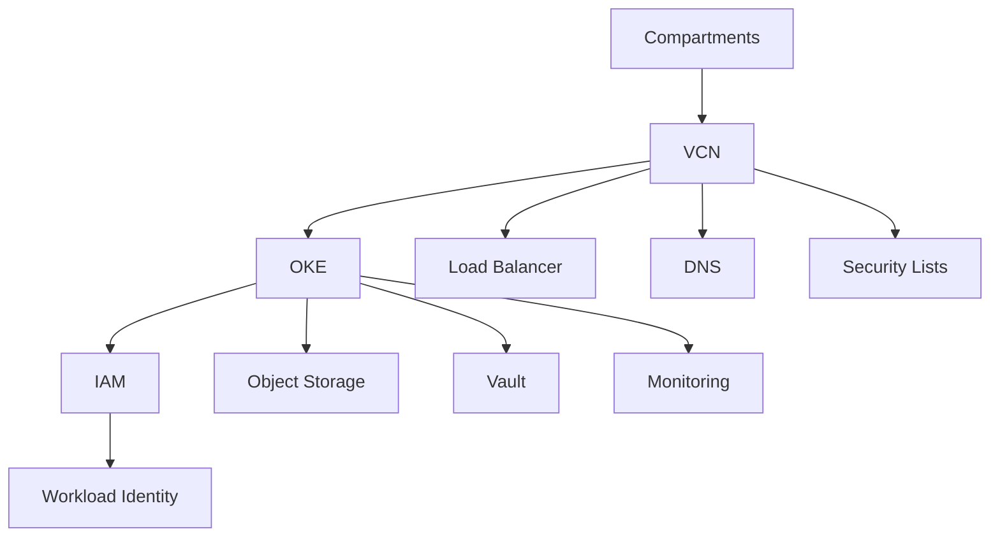

# Oracle Cloud Infrastructure (OCI) Modules

<p align="center">
  
</p>

<p align="center">
  <strong>Production-ready Terraform modules for Oracle Cloud Infrastructure</strong>
</p>

## 📅 Status: Coming Q2 2026

Oracle Cloud modules are planned for Q2 2026. We're currently in the early planning phase, evaluating Oracle Cloud Infrastructure capabilities and designing the module architecture.

## 🎯 Planned Modules

### Core Infrastructure

#### **OKE** - Oracle Kubernetes Engine
- OKE cluster with configurable node pools
- Service mesh integration
- Private cluster options
- Security hardening and compliance
- Multi-availability domain support

#### **VCN** - Virtual Cloud Network
- Virtual Cloud Network with subnets
- Security Lists and Network Security Groups
- Internet Gateway and NAT Gateway
- Dynamic Routing Gateway
- FastConnect integration

#### **Compartments** - Compartment Management
- Compartment creation and organization
- Resource organization and isolation
- Access control and permissions
- Cost tracking and management
- Lifecycle management

### Storage & Data

#### **Object Storage** - OCI Object Storage
- Object Storage buckets
- Data lifecycle management
- Cross-region replication
- Backup and disaster recovery
- Security and encryption

#### **Block Storage** - Block Volume
- Block Volume management
- Volume groups and backups
- Performance optimization
- Encryption and security
- Multi-attach support

#### **File Storage** - File System
- File System creation
- Mount target configuration
- NFS and SMB protocols
- Backup and snapshots
- Performance tuning

### Identity & Access

#### **IAM** - Identity and Access Management
- User and group management
- Policy creation and assignment
- Dynamic groups
- Federation and SSO
- Audit and compliance

#### **Vault** - Secrets Management
- Vault creation and configuration
- Secret and key management
- Certificate management
- Hardware Security Module (HSM)
- Integration with OKE

### Networking & Security

#### **Load Balancer** - Load Balancing
- Application Load Balancer
- Network Load Balancer
- SSL termination
- Health checks
- Traffic distribution

#### **DNS** - DNS Management
- DNS zones and records
- Private DNS zones
- Health checks
- Traffic management
- Custom domain integration

### Monitoring & Operations

#### **Monitoring** - OCI Monitoring
- Monitoring service integration
- Custom metrics and alarms
- Logging and log analytics
- Dashboards and visualization
- Cost management

#### **Backup** - Backup Services
- Automated backup policies
- Cross-region backup
- Point-in-time recovery
- Compliance reporting
- Disaster recovery

## 🏗️ Planned Architecture

### Complete OCI Deployment



### Security-First Design

```hcl
# Planned security-hardened OKE cluster
module "oke" {
  source = "git::https://github.com/fast-bi/data-platform-terraform-module.git//oracle_cloud/oke"

  # Network security
  private_cluster_enabled = true
  network_plugin = "oci"

  # Identity and access
  workload_identity_enabled = true
  service_account_enabled = true

  # Security features
  enable_pod_security_policy = true
  enable_network_policy = true

  # Monitoring
  monitoring_enabled = true
  log_analytics_enabled = true
}
```

## 🚀 Getting Ready for Oracle Cloud

### Prerequisites (When Available)

- [Terraform](https://www.terraform.io/downloads.html) >= 1.0
- [OCI CLI](https://docs.oracle.com/en-us/iaas/Content/API/SDKDocs/cliinstall.htm)
- Oracle Cloud account with appropriate permissions
- Object Storage bucket for Terraform state

### Planned Quick Start

```hcl
# Planned basic OKE deployment
module "oke" {
  source = "git::https://github.com/fast-bi/data-platform-terraform-module.git//oracle_cloud/oke"

  compartment_id = "ocid1.compartment.oc1..example"
  vcn_id        = module.vcn.vcn_id
  cluster_name   = "fastbi-cluster"
  node_count     = 3
  node_shape     = "VM.Standard.E4.Flex"
}
```

## 🛡️ Security Considerations

### Planned Security Features

- **Private Clusters**: Secure cluster endpoints
- **Service Accounts**: No secrets in code
- **IAM Policies**: Fine-grained access control
- **Network Policies**: Pod-to-pod communication control
- **Encryption**: At rest and in transit
- **Compliance**: SOC 2, ISO 27001, HIPAA

### Identity and Access Management

- **OCI IAM Integration**: Enterprise identity
- **Workload Identity**: Pod-to-OCI authentication
- **Service Accounts**: Application authentication
- **Dynamic Groups**: Resource-based access
- **Audit Logging**: Comprehensive audit trail

## 📊 Monitoring and Observability

### Planned Monitoring Features

- **OCI Monitoring**: Comprehensive monitoring
- **Log Analytics**: Centralized logging
- **Alarms**: Proactive notifications
- **Dashboards**: Visual monitoring
- **Cost Management**: Resource optimization
- **Performance Monitoring**: Application insights

## 🔄 Development Timeline

### Q3 2025 - Research & Planning
- [ ] OCI capabilities evaluation
- [ ] Requirements gathering
- [ ] Architecture design
- [ ] Security review

### Q4 2025 - Design & Prototyping
- [ ] Module interface design
- [ ] Security architecture
- [ ] Networking design
- [ ] Performance testing

### Q1 2026 - Development
- [ ] Core modules development
- [ ] Security modules
- [ ] Networking modules
- [ ] Testing and validation

### Q2 2026 - Release & Documentation
- [ ] Documentation completion
- [ ] Example deployments
- [ ] Community feedback
- [ ] Production readiness

## 🤝 Contributing

We welcome contributions to the Oracle Cloud modules development:

1. **Requirements**: Share your OCI infrastructure needs
2. **Design**: Help design module interfaces
3. **Testing**: Participate in beta testing
4. **Documentation**: Help create comprehensive docs

### How to Get Involved

- **GitHub Issues**: Share requirements and feedback
- **Discussions**: Join design discussions
- **Beta Testing**: Sign up for early access
- **Documentation**: Help improve docs

## 📚 Resources

### Oracle Cloud Documentation
- [Oracle Kubernetes Engine](https://docs.oracle.com/en-us/iaas/Content/ContEng/Concepts/contengoverview.htm)
- [Virtual Cloud Network](https://docs.oracle.com/en-us/iaas/Content/Network/Concepts/overview.htm)
- [Identity and Access Management](https://docs.oracle.com/en-us/iaas/Content/Identity/Concepts/overview.htm)
- [Object Storage](https://docs.oracle.com/en-us/iaas/Content/Object/Concepts/objectstorageoverview.htm)

### Terraform OCI Provider
- [Terraform OCI Provider](https://registry.terraform.io/providers/oracle/oci/latest/docs)
- [OCI Provider Examples](https://github.com/oracle/terraform-provider-oci/tree/main/examples)

### Fast.BI Resources
- [Fast.BI Documentation](https://wiki.fast.bi)
- [Fast.BI Community](https://fast.bi/community)
- [GitHub Discussions](https://github.com/fast-bi/data-platform-terraform-module/discussions)

## 📄 License

This module is licensed under the [MIT License](../LICENSE).

---

<p align="center">
  <strong>Interested in Oracle Cloud support?</strong><br>
  <a href="https://github.com/fast-bi/data-platform-terraform-module/discussions">Join the Discussion</a> •
  <a href="https://fast.bi">Get Started with Fast.BI</a> •
  <a href="https://wiki.fast.bi">Documentation</a>
</p>
